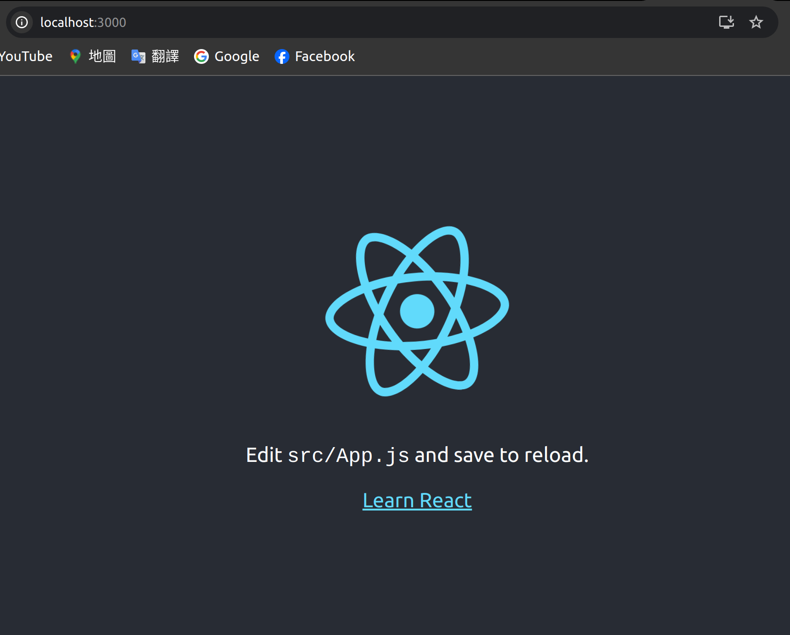

# React environment
這邊以Ubuntu為例

## NodeJs & npm
1. 下載 NodeJS (20.x表示是20的LST版本，這邊請根據自己選擇)
```
curl -fsSL https://deb.nodesource.com/setup_20.x | sudo -E bash -
```

2. Install NodeJs (npm也會同時安裝)
```
sudo apt install -y nodejs
```
如果有遇到dpkg error可以試著先執行下面兩行再來install一次
```
sudo dpkg --remove --force-remove-reinstreq libnode-dev
sudo dpkg --remove --force-remove-reinstreq libnode72:amd64
```

3. 檢查是否安裝成功 (檢查版本)
```
node -v
npm -v
```

## Create React app
Facebook有建立一套簡單建立react app的模板 (create-react-app)
1. 建立模板
```
npm install -g create-react-app
```

2. 創建project資料夾
```
create-react-app my_app
```

3. 測試是否正常
```
cd my_app
npm start
```
若看到以下畫面表示正常啟動，可以開始開發了

